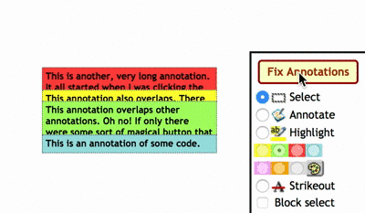

# GradeIt annotation fixer

Adds a button to GradeIt (gradeit.cs.washington.edu) to move annotations so they don't overlap.

## Installation:

Download the repo.

Go to [chrome://extensions](chrome://extensions) and choose "load unpacked extension", then select the `extension` subfolder of this repo.

## Usage:

Make some annotations, then click the button!
